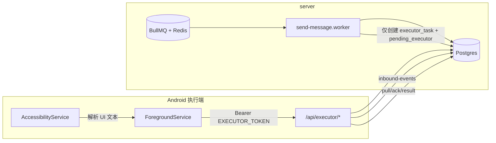

# wework-ai-assistant（Monorepo · 自托管 MVP）

**唯一后端**：`server/`（Node.js + Fastify + Prisma + BullMQ）。  
**唯一执行端**：`android-executor/`（Kotlin + 无障碍自动化）。  
**不依赖 WorkTool 商业 API**；`server/src/integrations/worktool` 仅为 **deprecated** 兼容映射/类型，**不能作为主链路**。

> **历史清理**：根目录旧版 `src/`（与 `server` 重复）已删除。数据库与 Prisma 仅以 `server/prisma` 为准。

## 架构图



## 自托管链路（主路径）

1. App 上报群消息 → `POST /api/executor/inbound-events` → `inbound_events` → 入队 → 决策 → 可能创建 `outbound_messages`（`pending`）。
2. 队列 → `send-message.worker` **仅** `createSendTextExecutorTask`，并把 `outbound_messages.sendStatus` 置为 **`pending_executor`**（不调用 WorkTool 发送）。
3. App `pull` / `ack` / 无障碍发消息 → `POST .../result` → 仅此接口将任务与关联 `outbound_messages` 更新为 **`success` / `failed`**。
4. 机器人/设备在线状态：由 **`device_heartbeats` + 调度任务 `refreshRobotOnlineFromDevices`** 推断，**不依赖 WorkTool**。

## 目录结构

```text
wework-ai-assistant/
├── server/                 # 唯一后端
├── android-executor/       # 唯一执行端
├── docker-compose.yml
├── package.json            # monorepo 入口脚本
└── README.md
```

## 根目录脚本（monorepo）

| 命令 | 说明 |
|------|------|
| `pnpm dev` / `pnpm dev:server` | 启动 `server`（`tsx watch src/main.ts`） |
| `pnpm dev:android` | 仅打印说明：请在 `android-executor` 用 Android Studio 运行 App |
| `pnpm test` | 运行 `server` Vitest |
| `pnpm build` | 构建 `server` |

## 本地一键启动（Windows / PowerShell）

### 脚本

| 文件 | 作用 |
|------|------|
| [`scripts/bootstrap-dev.ps1`](scripts/bootstrap-dev.ps1) | 检查 `node` / `pnpm` / `docker`；缺 `pnpm` 时尝试 `corepack` 或 `npm i -g pnpm@9.12.3`；若无 `server/.env` 则从 `.env.example` 复制；`docker compose up -d postgres redis`；在 `server/` 执行 `pnpm install`、`pnpm prisma:generate`、**`pnpm prisma:deploy`**（无交互应用已有迁移）、`pnpm exec prisma db seed`、**`pnpm test`**（可用 `-SkipTest` 跳过） |
| [`scripts/smoke-executor.ps1`](scripts/smoke-executor.ps1) | 检测 `MANUAL_API_BASE_URL`（默认 `http://127.0.0.1:3000`）下 `/api/health`；在 `server/` 顺序执行 `manual:register-device` → `send-heartbeat` → `mock-inbound-event` → `create-test-send-task` → `pull-task`（解析 `SMOKE_TASK_ID=`）→ `ack-task` → `report-task-result`。**需先另开终端启动 API**（根目录 `pnpm dev`） |

在项目根执行（建议先：`Set-ExecutionPolicy -Scope CurrentUser RemoteSigned`），或：

```bash
pnpm bootstrap
pnpm smoke:executor
```

```powershell
.\scripts\bootstrap-dev.ps1
# 自备数据库时:
.\scripts\bootstrap-dev.ps1 -SkipDocker
# 仅初始化不测:
.\scripts\bootstrap-dev.ps1 -SkipTest
```

API 起来后再跑冒烟：

```powershell
.\scripts\smoke-executor.ps1
```

### 说明：`migrate deploy` 与 `migrate dev`

一键脚本使用 **`pnpm prisma:deploy`**（`prisma migrate deploy`），避免 `migrate dev` 在脚本里阻塞等待交互。需要**新建迁移**时在本机手动：`cd server` → `pnpm prisma:migrate`。

### 本次自动化执行记录（Cursor 环境）

| 步骤 | 结果 |
|------|------|
| 检查 `node` / `pnpm` | **失败**：当前沙箱终端 `PATH` 中未找到 `node`、`pnpm`、`cmd`、`where`（无法在此环境直接跑 `pnpm install` / `pnpm test`） |
| 检查 `docker` | **成功**：`docker --version` → Docker 29.2.1 |
| `docker compose up -d postgres redis` | **成功**：为修复「project name must not be empty」，已在 [`docker-compose.yml`](docker-compose.yml) 增加顶层 `name: wework-ai-assistant`；容器 `wework-ai-postgres`、`wework-ai-redis` 已启动 |
| `pnpm install` / `prisma` / `vitest` | **未在本沙箱执行**；请在你本机 PowerShell 中运行 `.\scripts\bootstrap-dev.ps1` 完成 |

**若 bootstrap 某步失败**：脚本会打印 `[失败]` 与 **修复** 提示；常见修复：`cd server; pnpm install`、`pnpm prisma:generate`、`pnpm prisma:deploy`、检查 `server/.env` 中 `DATABASE_URL`/`REDIS_URL` 与 Docker 端口一致。

## 本地启动顺序

1. `docker compose up -d postgres redis`（或自备 Postgres/Redis）。
2. `cd server && cp .env.example .env`，填写 `DATABASE_URL`、`REDIS_URL`、`ADMIN_TOKEN`、`EXECUTOR_SHARED_TOKEN`、`DEFAULT_ROBOT_ID`、`LLM_*`。
3. `pnpm install`（在 monorepo 根或 `server` 按你习惯）。
4. `cd server && pnpm prisma:generate && pnpm prisma:migrate && pnpm prisma:seed`（可选 seed）。
5. 根目录 `pnpm dev` 或 `cd server && pnpm dev`。

## 手动脚本联调顺序

见 **`server/scripts/manual/README.md`**。概要：`register-device` → `send-heartbeat` → `mock-inbound-event`（可选）→ `create-test-send-task`（需 `ADMIN_TOKEN`）→ `pull-task` → `ack-task` → `report-task-result`。

## Android 真机联调顺序

1. 手机与 PC 同网，防火墙放行 `PORT`（默认 3000）。
2. App 填写 **Backend Base URL**（例 `http://192.168.1.10:3000`）、**Executor Token**、**Robot ID**、**Device Name**。
3. **保存配置** → **注册设备并启动服务** → 开启无障碍（企业微信包名 `com.tencent.wework`）→ 建议 **忽略电池优化**。
4. 打开企业微信群聊页，观察上行；用管理端测试任务或脚本创建 `send_text` 任务，观察 pull/发送/result。

## 常见问题

| 现象 | 排查 |
|------|------|
| 设备已注册但 `pull` 不到任务 | 任务是否 `pending`、`type=send_text`；`pull` 的 `robotId`/`deviceId` 是否与库一致；App `capability` 是否含 `send_text`。 |
| 心跳正常但机器人不发送 | 上行是否触发 `shouldReply`；`outbound_messages` 是否仍为 `pending` 或被预检置为 `cancelled`；队列与 worker 是否运行。 |
| 上报了消息但没有 `executor_task` | 仅当产生待发 `outbound` 且 worker 执行后才会创建任务；看 `outbound_messages.sendStatus` 是否进入 `pending_executor`。 |
| `task` 已成功但 `outbound_messages` 未更新 | 任务是否带 `outboundMessageId`；是否走的 `POST .../result`；重复 `result` 对已终态任务为幂等，不会改回。 |

## 合规与能力边界（声明）

- **不购买** WorkTool **robotId**，**不依赖** WorkTool **商业版**作为主发送通道。
- 仅支持 **用户自有安卓设备** + **用户已登录的企业微信账号** + **系统无障碍** 完成 UI 自动化；请自行评估平台协议与内控要求。

更多服务端细节见 **[server/README.md](server/README.md)**。
