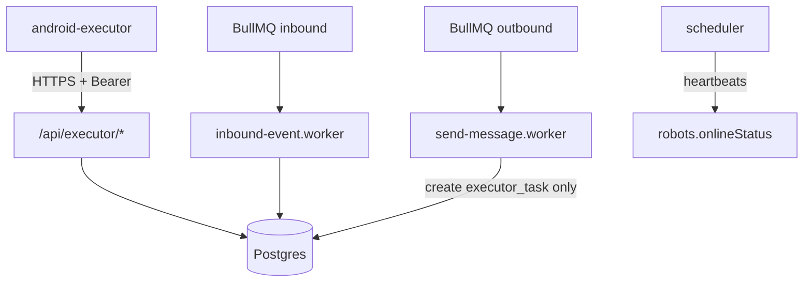

# server（唯一后端）

自托管 API 与任务编排。**执行端 HTTP**：`/api/executor/*`（`Authorization: Bearer <EXECUTOR_SHARED_TOKEN>`）。**管理端**：`/api/admin/*`（`ADMIN_TOKEN`）。

**WorkTool**：`src/integrations/worktool` 仅为 **deprecated** 回调字段映射等兼容层，**禁止作为主发送链路**；主链路为 **自建 Android 执行端**（`executor_tasks` + `pull/ack/result`）。

## 架构图（与根 README 一致）

## 自托管链路说明

- **上行**：`POST /api/executor/inbound-events`（幂等键 `eventUid`）→ 与原有 inbound 处理一致。
- **下行**：`outbound_messages` `pending` → 入队 → **`send-message.worker` 只创建 `executor_tasks`，并把 outbound 标为 `pending_executor`** → 设备 `ack` 后任务为 `running` → **`POST .../result` 唯一**更新 outbound `success`/`failed`。
- **鉴权**：所有 `/api/executor/*` 经 **`EXECUTOR_SHARED_TOKEN`**；未授权统一 `{ success:false, error:{ code, message } }`。
- **任务状态**：`pending → claimed → running → success|failed|cancelled`；非法跳转 `409`（如未 `ack` 即 `result`）。

## 脚本

| 命令 | 说明 |
|------|------|
| `pnpm dev` | 开发 |
| `pnpm build` | 编译 |
| `pnpm test` | Vitest（需可用 `DATABASE_URL`） |
| `pnpm prisma:migrate` | 迁移 |
| `pnpm manual:*` | 见 `scripts/manual/README.md` |

## 环境变量

复制 `.env.example` 为 `.env`。手动脚本额外变量见 `.env.example` 底部注释。

## 本地启动顺序

1. Postgres + Redis。
2. `pnpm prisma:generate && pnpm prisma:migrate`。
3. `pnpm dev`。

## 手动脚本联调

目录 **`scripts/manual/`**，说明见 **`scripts/manual/README.md`**。

## Android 真机联调

见根目录 **`../README.md`**「Android 真机联调顺序」。

## 常见问题

与根 **`README.md`**「常见问题」表一致：pull 不到任务、未创建 task、outbound 未更新等多为 **robotId/deviceId/任务状态/outbound 关联** 问题，可用 `scripts/manual` 与 `GET /api/admin/executor-tasks` 对照。

## 声明

本仓库 **不依赖 WorkTool 商业版作为主链路**，**不要求购买 robotId**；发送依赖 **用户设备 + 无障碍 + 企业微信前台 UI**。
